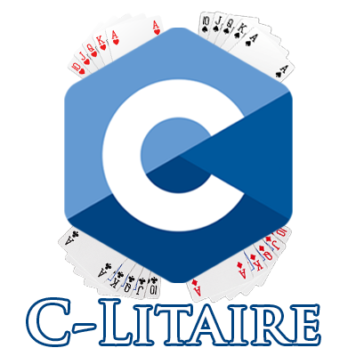

A collection of solitaire games recreated in C.

Made for a university project that has the intention of being as fast and small as possible.

Currently some project restrictions are stopping us from achieving that goal, but we will continue to code after this semester.

## Students

José Diogo Ferreira Barbosa (a96609)

João Sá Parreira (a114898)

Pedro Henrique Dos Santos Silva (a112985)

## 👷‍♂️ How to run C-litaire:

- Clone this repository

```sh
make run
```

